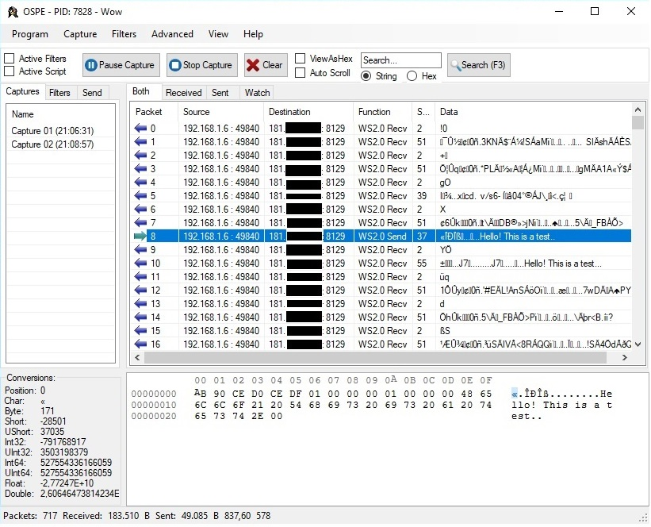
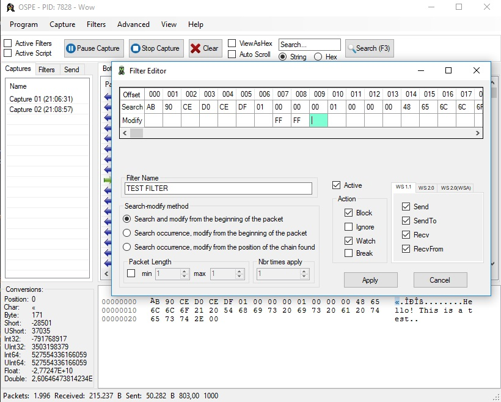
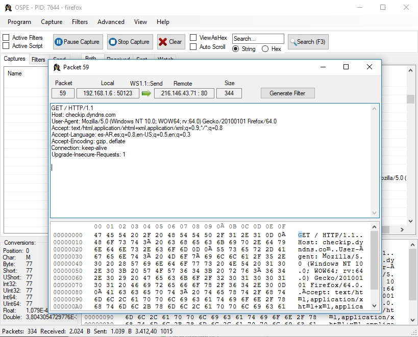

#  OSPE - Open Source Packet Editor

 

--------------

* [Introduction](#introduction)
* [Features](#Features)
* [Limitations](#Limitations)
* [Usage](#Usage)
* [Screenshots](#Screenshots)

## Introduction

OSPE is an open source sniffer and packet editor written in C# and C++.

This program injects a custom DLL into target's process and setup hooks functions, this allows to execute arbitrary code, halt program execution and/or modify sent/received traffic data from the process.

## Legal Disclaimer

Attacking targets without prior mutual consent is illegal. The author is not responsible for any misuse or damage caused by this program.

## Features

- Sniff traffic and save captures.
- Halt the program execution based on conditions (defined in a filter).
- Create filters and modify data for sent/received packets.
- Setup Hotkeys.
- Display data in Hex or ASCII and search for patterns.
- And more.

## Limitations

- Exporting captures as HTML or TXT not implemented.
- Packet injection to a new socket not implemented.
- Custom script creator not implemented.
- Target's process may crash unexpectedly.

## Usage

1) Compile the main program and the DLL. 
2) Start the program.
3) Select a process
4) A new dialog will open for the location of the DLL to be injected.
5) Select the x86 or x64 dll and then start a capture.

## Screenshots

